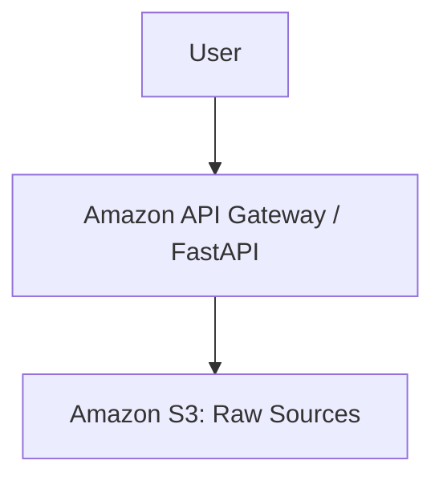

# Aegis — Self-Correcting Multimodal GraphRAG Platform

> **Aegis does not simply generate an answer. It retrieves evidence, reasons over that evidence, verifies the answer, and corrects its retrieval when necessary.**

## Problem

Generic 'chat with your PDF' applications suffer from blind hallucinations, context fragmentation, and unverified citations.

## Solution

Aegis eliminates these vulnerabilities through structure-aware ingestion, grounded generation, and autonomous self-correction.

## Architecture

