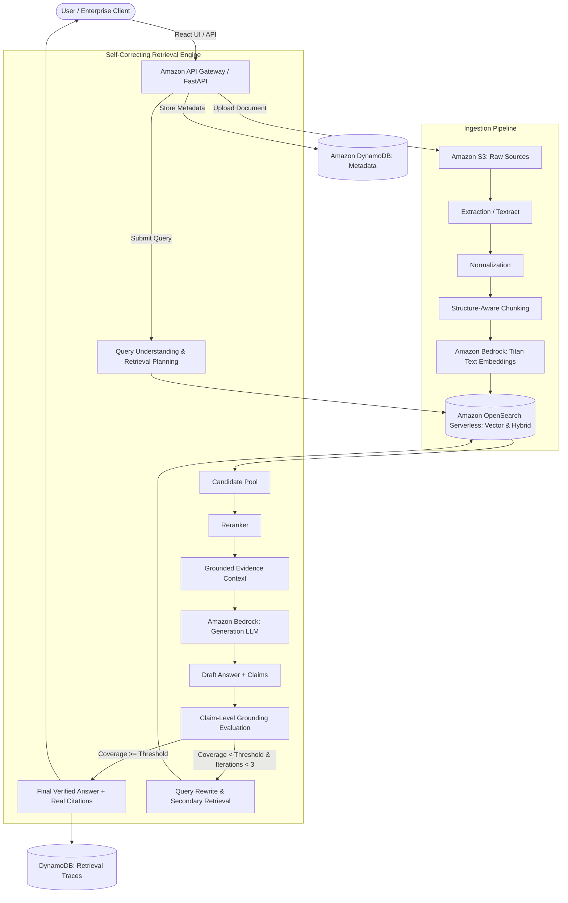

# Aegis — Self-Correcting Multimodal GraphRAG Platform

> **Aegis does not simply generate an answer. It retrieves evidence, reasons over that evidence, verifies the answer, and corrects its retrieval when necessary.**

Aegis is an enterprise-grade, evidence-first knowledge intelligence platform built on AWS. Designed to solve the pervasive hallucination problem in enterprise AI, Aegis combines structure-aware document parsing, hybrid vector/keyword retrieval, claim-level factual grounding, and an autonomous self-correction loop to deliver verifiable, cited answers from complex documents.

---

## Problem

Generic "chat with your PDF" applications and basic RAG architectures suffer from critical flaws that make them unsuitable for enterprise deployment:
1. **Blind Hallucination**: Models confidently generate answers when evidence is missing or ambiguous.
2. **Context Fragmentation**: Naive fixed-size chunking severs headers, tables, and hierarchical sections, destroying provenance.
3. **Unverified Citations**: Chatbots hallucinate page numbers or cite irrelevant paragraphs.
4. **Single-Shot Failure**: If the initial vector search returns substandard context, the system has no mechanism to critique its own retrieval and re-query.
5. **Silent Disagreements**: When documents contain conflicting facts or policies, standard RAG silently chooses one or blends them into nonsense.

---

## Solution

Aegis eliminates these vulnerabilities through an evidence-first architecture:
* **Structure-Aware Ingestion**: Preserves document hierarchy, page numbers, section headers, and tabular boundaries.
* **Grounded Generation**: Bedrock foundation models generate claims tied to specific chunk IDs and document metadata.
* **Claim-Level Grounding Evaluation**: Answers are decomposed into atomic factual claims and cross-checked against retrieved source text.
* **Autonomous Self-Correction Loop**: When evidence sufficiency drops below threshold, Aegis reformulates the query, executes targeted secondary retrieval, and re-evaluates before presenting the answer.
* **Audit-Ready Citations & Retrieval Trace**: Every response exposes verifiable source excerpts and the full retrieval/reasoning trace.

---

## Architecture



---

## Demonstrated Technical Story & Implementation Scope

Aegis is built around an uncompromising, mathematically grounded technical story:

$$\text{Document} \longrightarrow \text{Structure-Aware Extraction} \longrightarrow \text{Provenance Chunking} \longrightarrow \text{Bedrock Embeddings} \longrightarrow \text{Hybrid Retrieval} \longrightarrow \text{Grounded Answer} \longrightarrow \text{Self-Correction} \longrightarrow \text{Traceability}$$

> 📋 **Detailed Architecture Scope**: For full transparency regarding verified components versus roadmap scaffolding, see [docs/ARCHITECTURE_IMPLEMENTED.md](docs/ARCHITECTURE_IMPLEMENTED.md).
>
> 🏆 **Judges Quickstart & CLI Verification**: Run automated verification in 1 command using [docs/JUDGES_EVALUATION_GUIDE.md](docs/JUDGES_EVALUATION_GUIDE.md).

---

## 🎬 Demonstration Video & Walkthrough

A high-definition video walkthrough showing live multi-pass self-correction, factual grounding, citation drawers, and trace modals is included directly in the repository:

* 📽️ **Universal MP4 Video (720p HD, H.264)**: [`recordings/aegis_demo_walkthrough.mp4`](recordings/aegis_demo_walkthrough.mp4) (9.5 MB)
* 🌐 **Web-Native WebM Video (720p HD, VP8)**: [`recordings/aegis_demo_walkthrough.webm`](recordings/aegis_demo_walkthrough.webm) (4.3 MB)
* 📝 **Full Scene Timestamps & Transcription**: See [docs/DEMO_WALKTHROUGH.md](docs/DEMO_WALKTHROUGH.md)

---

## AWS Services

| AWS Service | Purpose in Aegis |
| :--- | :--- |
| **Amazon Bedrock** | Embeddings generation (`Titan Text Embeddings v2`), primary generation LLM (`Amazon Nova Pro` / `Anthropic Claude 3.5 Sonnet`), query rewriting, and claim grounding verification. |
| **Amazon OpenSearch Serverless** | Vector search and hybrid BM25 keyword retrieval for indexed document chunks. |
| **Amazon S3** | Encrypted, private object store for raw uploaded documents and processed chunk artifacts. |
| **Amazon DynamoDB** | Low-latency state store for document processing states, conversation logs, and retrieval traces. |
| **Amazon Textract** | Multi-page PDF layout analysis, OCR, and table extraction preserving structural provenance. |
| **Amazon CloudWatch** | Centralized logs, operational metrics, ingestion duration, retrieval latency, and grounding telemetry. |
| **Amazon API Gateway / Lambda** | Serverless API layer orchestrating asynchronous ingestion and query lifecycles. |

---

## RAG Pipeline

1. **Ingestion & Normalization**: Documents (PDF, TXT, images) are uploaded to private S3 buckets. Asynchronous extraction preserves layout, page numbers, and tables.
2. **Structure-Aware Chunking**: Text is split along structural boundaries (headings, sections, paragraphs) while retaining metadata tags (`document_id`, `filename`, `page`, `chunk_id`).
3. **Vector Indexing**: Chunks are embedded via Bedrock Titan v2 into high-dimensional vectors (1024-dim) and indexed into OpenSearch Serverless.
4. **Retrieval & Reranking**: Queries retrieve top-k candidate chunks via semantic similarity and keyword matching, followed by relevance reranking.
5. **Generation & Verification**: The LLM synthesizes an evidence-backed answer. The verification engine extracts claims, validates them against chunk excerpts, and computes a grounding score.

---

## Self-Correction Loop in Action

Unlike standard single-shot RAG pipelines, Aegis implements an autonomous, multi-pass verification loop:

| Stage | Action | State Transition |
| :--- | :--- | :--- |
| **Pass 1: Initial Retrieval** | Vector and lexical search fetch top candidates. | Grounding Evaluated ($C_1$). If $C_1 \ge 0.75$, answer finalized. |
| **Pass 1: Deficiency Detection**| If $C_1 < 0.75$ (e.g. cross-document project info missing), self-correction triggers. | Flag: `self_correction_triggered: true`. |
| **Autonomous Reformulation** | Unsupported claims are extracted and synthesized into an expanded target query. | Query rewritten to target missing document chunks. |
| **Pass 2: Augmented Retrieval**| Secondary retrieval executes, deduplicating with previous evidence. | Grounding Evaluated ($C_2 \ge 0.80$). Consensus reached. |
| **Final Verification & Output**| Answer rendered with inline verified tags and dual-document citations. | `Self-Corrected (2 Passes)` badge displayed with full reasoning trace. |

If evidence remains insufficient after 3 iterations, Aegis falls back gracefully rather than hallucinating:
> *"I couldn't find sufficient evidence in the uploaded sources to answer this confidently."*

---

## Local Development

### Prerequisites
* Node.js >= 18 (Tested on v24.14.0)
* Python >= 3.11 (Tested on v3.13.9)
* AWS CLI v2 with configured credentials (`aws configure`)

### 1. Clone & Configure Environment
```bash
cp .env.example .env
# Edit .env with your AWS region and resource identifiers
```

### 2. Backend Setup
```bash
cd backend
python -m pip install -r requirements.txt
python -m uvicorn app.main:app --reload --port 8000
```
API Documentation will be available at `http://localhost:8000/docs`.

### 3. Frontend Setup
```bash
cd frontend
npm install
npm run dev
```
Frontend development server runs on `http://localhost:5173`.

---

## AWS Deployment

Aegis uses AWS SAM (Serverless Application Model) for reproducible Infrastructure as Code:

```bash
cd infrastructure
sam build
sam deploy --guided \
  --stack-name aegis-stack-dev \
  --region ap-south-1 \
  --capabilities CAPABILITY_IAM
```

---

## Environment Variables

Key parameters defined in `.env.example`:
* `AWS_REGION`: Target AWS deployment region (e.g., `ap-south-1`).
* `S3_BUCKET_DOCUMENTS`: S3 bucket for uploaded knowledge sources.
* `DYNAMODB_DOCUMENTS_TABLE`: Table storing document state and chunks metadata.
* `BEDROCK_EMBEDDING_MODEL_ID`: Bedrock embedding model (default: `amazon.titan-embed-text-v2:0`).
* `BEDROCK_GENERATION_MODEL_ID`: Bedrock generation LLM (default: `amazon.nova-pro-v1:0`).
* `OPENSEARCH_ENDPOINT`: OpenSearch Serverless collection endpoint.
* `GROUNDING_THRESHOLD`: Grounding acceptance threshold (default: `0.75`).
* `MAX_SELF_CORRECTION_ATTEMPTS`: Re-retrieval safety ceiling (default: `3`).

---

## Testing

### Backend Unit & Integration Tests
```bash
python -m pytest backend/tests -v
```

### Frontend Typecheck & Build
```bash
cd frontend
npm run typecheck
npm run build
```

---

## Security

* **IAM Least Privilege**: Lambda execution roles are scoped strictly to required S3 buckets, DynamoDB tables, and Bedrock model ARNs.
* **Zero Hardcoded Secrets**: No AWS access keys or secrets in source code or client bundles. All credentials resolve via IAM instance roles or AWS CLI profiles.
* **Encrypted Storage**: S3 buckets enforce server-side AES-256 encryption and block all public access. DynamoDB tables use AWS-managed encryption at rest.
* **Safe Telemetry**: CloudWatch logs mask document text, avoiding exposure of sensitive information.

---

## Hackathon Submission

* **Hackathon**: AWS Zero to Shipped
* **Target Category**: `#commercial-potential`
* **Target Lane**: `#startup`
* **Autonomous Agent**: Developed with OpenCode as lead architectural coding agent.
