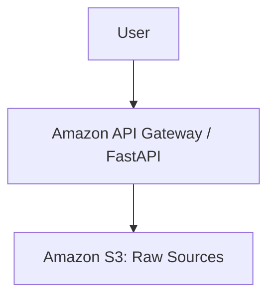

# Aegis — Self-Correcting Multimodal GraphRAG Platform

> **Aegis does not simply generate an answer. It retrieves evidence, reasons over that evidence, verifies the answer, and corrects its retrieval when necessary.**

## Problem

Generic 'chat with your PDF' applications suffer from blind hallucinations, context fragmentation, and unverified citations.

## Solution

Aegis eliminates these vulnerabilities through structure-aware ingestion, grounded generation, and autonomous self-correction.

## Architecture

## AWS Services

- Amazon Bedrock: Titan Text Embeddings & Nova Lite
- Amazon OpenSearch Serverless: Vector search
- Amazon S3: Raw and processed artifacts
- Amazon DynamoDB: Metadata state store

## RAG Pipeline

1. Ingestion & Normalization
2. Structure-Aware Chunking
3. Vector Indexing
4. Retrieval & Reranking
5. Generation & Verification

## Self-Correction Loop

When evidence sufficiency drops below threshold, Aegis reformulates the query and performs secondary retrieval up to 3 times.

## Local Development

Instructions for setting up Node.js, Python, and AWS CLI.

## AWS Deployment

Deploy using AWS SAM (Serverless Application Model).

## Security

IAM least privilege, encrypted S3 buckets, zero hardcoded credentials.

