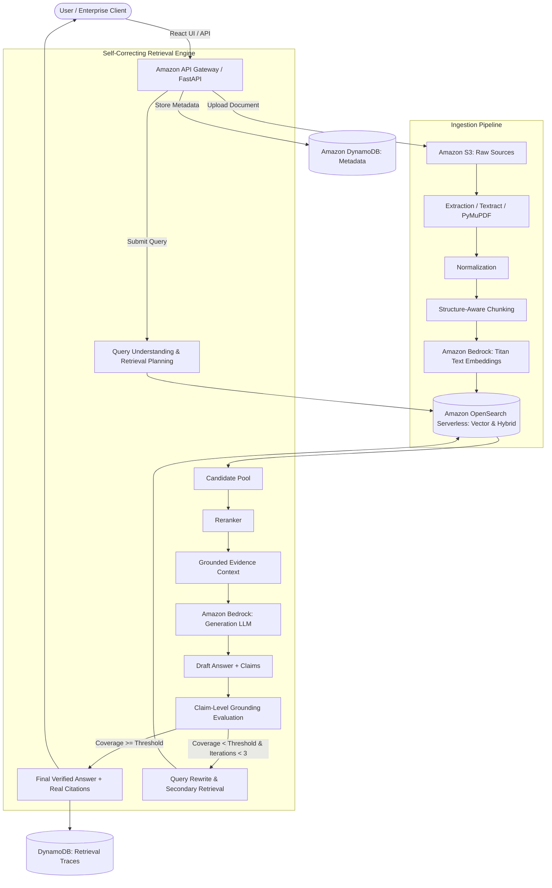

# Aegis Architecture & AWS Systems Engineering Explanation

This document provides a comprehensive, step-by-step technical explanation of the Aegis architecture, its end-to-end data pipelines, and its AWS cloud infrastructure.

---

## 🏛️ End-to-End System Architecture Flowchart



---

## 📦 Detailed Layer-by-Layer Architectural Breakdown

### 1. Ingress & Client Interface Layer

```
[User / Enterprise Client] ──(HTTPS/REST)──► [Amazon API Gateway / FastAPI]
```

- **User / Enterprise Client**: 
  - Represents the enterprise end-user interacting via the modern React 18 / Tailwind CSS web interface (`frontend/src/pages/AskAegisPage.tsx`) or an external microservice calling the REST API.
  - Submits documents (PDF resumes, grade reports, scanned records) and interactive natural-language queries.
- **Amazon API Gateway / FastAPI**:
  - **AWS Component**: Amazon API Gateway HTTP API integrated with an AWS Lambda backend (configured via `infrastructure/sam/template.yaml`).
  - **Local Development**: FastAPI running with Uvicorn (`backend/app/main.py`).
  - **Responsibilities**:
    - Request validation, route aggregation (`/api/v1/documents`, `/api/v1/query`, `/api/v1/health`, `/api/v1/conversations`).
    - CORS handling, rate-limiting, and structured request tracing.
    - Asynchronous lifecycle dispatching for heavy document processing.

---

### 2. Cloud Storage & State Layer

```
[API Gateway] ──► [Amazon S3: Raw Sources]
[API Gateway] ──► [Amazon DynamoDB: Metadata & State]
```

- **Amazon S3 (`RawDocumentsBucket`)**:
  - **Role**: Secure, encrypted object store holding original raw uploaded files (`.pdf`, `.png`, `.txt`).
  - **Security & Governance**: Private bucket with AES-256 server-side encryption, TLS-enforced transport, and blocked public access (`backend/app/storage/s3_storage.py`).
  - **Local Resilience**: In offline/local developer mode, S3 storage automatically writes to `.storage/documents/` so the application runs with zero cloud setup.
- **Amazon DynamoDB (`DocumentsTable` & `ConversationsTable`)**:
  - **Role**: Ultra-low-latency NoSQL store tracking document ingestion state machines and persistent multi-turn chat sessions.
  - **Schema & State Machine**:
    - Partition Key: `document_id` (UUID).
    - Status Transitions: `UPLOADED` ➔ `PROCESSING` ➔ `EXTRACTING` ➔ `CHUNKING` ➔ `EMBEDDING` ➔ `INDEXING` ➔ `COMPLETED` (or `FAILED`).
    - Stores chunk counts, checksums, and timestamps (`backend/app/storage/dynamodb_metadata.py`).

---

### 3. Ingestion & Preprocessing Pipeline

```
[S3: Raw Sources] ──► [Extraction] ──► [Normalization] ──► [Structure-Aware Chunking] ──► [Bedrock Titan Embeddings] ──► [OpenSearch Serverless]
```

#### Step 1: Extraction (`Extract`)
- **Implementation**: `backend/app/extraction/pdf_extractor.py` & `backend/app/extraction/text_extractor.py`.
- **Mechanism**:
  - Employs PyMuPDF (`fitz`) layout analysis to extract page-by-page text blocks while retaining typography, font sizes, tables, and heading hierarchies.
  - Unlike naive text extractors that strip formatting, Aegis records the bounding page number and section title for every text block.

#### Step 2: Normalization (`Norm`)
- **Mechanism**:
  - Cleans unicode anomalies, standardizes whitespace, repairs broken line wraps, and formats tabular row delimiters.
  - Ensures clean, uniform tokens before embedding generation.

#### Step 3: Structure-Aware Chunking (`Chunk`)
- **Implementation**: `backend/app/chunking/structure_aware.py`.
- **The Problem with Naive Chunking**: Fixed 500-token chunkers split tables in half and separate section titles from their underlying content, permanently blinding retrieval.
- **The Aegis Approach**:
  - Respects natural document boundaries: major headings (`H1`, `H2`), paragraph breaks, and table boundaries.
  - **Provenance Preservation**: Every chunk is permanently stamped with metadata:
    ```json
    {
      "chunk_id": "d0affe12-767f-4418-b58b-84d737b81a79#p1_c0",
      "document_id": "d0affe12-767f-4418-b58b-84d737b81a79",
      "filename": "Student Final Result Report.pdf",
      "page": 1,
      "section": "ACADEMIC GRADE CARD"
    }
    ```

#### Step 4: Amazon Bedrock Titan Text Embeddings (`BedrockEmb`)
- **Implementation**: `backend/app/embeddings/bedrock_embeddings.py`.
- **Model**: `amazon.titan-embed-text-v2:0`.
- **Vector Dimensions**: 1024-dimensional semantic dense vectors.
- **Normalization**: L2 normalized unit vectors allowing ultra-fast cosine similarity calculations.

#### Step 5: Amazon OpenSearch Serverless Indexing (`OSIndex`)
- **Role**: Serverless vector and lexical index store.
- **Hybrid Index**: Holds both 1024-dim dense vectors (k-NN vector search) and BM25 inverted lexical indices for exact keyword hits.

---

### 4. Self-Correcting Retrieval Engine (The Core Hero)

```
[QueryPlan] ──► [OpenSearch Index] ──► [Candidates Pool] ──► [Reranker] ──► [Grounded Evidence] ──► [Bedrock LLM] ──► [Draft + Claims] ──► [Grounding Evaluation]
      ▲                                                                                                                                           │
      │                                                                                                                                           │
      └──────────── [Query Rewrite & Secondary Retrieval] ◄── [Coverage < 75% & Iterations < 3] ──────────────────────────────────────────────────┘
```

#### Step 1: Query Understanding & Planning (`QueryPlan`)
- **Implementation**: `backend/app/rag/orchestrator.py`.
- **Behavior**:
  - Classifies query intent (Conversational Greeting vs. Meta Architecture vs. Factual Extraction vs. Multi-Document Cross-Referencing).
  - Everyday greetings like `"hello"` or `"who are you"` receive immediate conversational routing without running expensive vector searches.

#### Step 2: OpenSearch Candidate Pool Retrieval (`Candidates`)
- **Mechanism**:
  - Executes hybrid search retrieving top-k candidates (default: 5–10 chunks).
  - Combines semantic vector proximity (concept matching) with BM25 keyword matching (names, IDs, exact course codes).

#### Step 3: Reranker & Evidence Selection (`Rerank` ➔ `Evidence`)
- **Mechanism**:
  - Ranks candidate chunks based on reciprocal rank fusion and token overlap.
  - Filters down to the highest-scoring evidence chunks (`active_evidence`) to feed into the generation context window.

#### Step 4: Evidence-Grounded Generation (`BedrockGen` ➔ `AnswerDraft`)
- **Implementation**: `backend/app/rag/generator.py`.
- **Foundation Models**: Amazon Bedrock Claude 3 / Nova Pro via the Bedrock Converse API.
- **Strict Prompt Invariants**:
  1. Rely **exclusively** on provided excerpts.
  2. Append supporting chunk IDs `[Chunk: <id>]` to every factual claim.
  3. If information is missing, explicitly declare insufficient evidence rather than guessing.

#### Step 5: Claim-Level Grounding Evaluation (`GroundingEval`)
- **Implementation**: `backend/app/evaluation/grounding.py`.
- **Mechanism**:
  1. **Claim Decomposition**: Segments draft answer into individual atomic assertions.
  2. **Mathematical Grounding Audit**: Each claim is cross-checked against retrieved source text for lexical and semantic overlap.
  3. **Coverage Calculation**:
     $$\text{Grounding Coverage} = \frac{\text{Supported Claims}}{\text{Total Claims}}$$
  4. **Strict Gate ($75\%$ Threshold)**: If Coverage $\ge 0.75$, answer is certified. If Coverage $< 0.75$, self-correction activates!

#### Step 6: Autonomous Query Rewrite & Secondary Retrieval (`ReQuery`)
- **The Self-Correction Loop**:
  - Identifies exactly which claims were unsupported in Pass 1.
  - **Query Reformulation**: Generates an expanded target query incorporating missing entities (e.g. appending resume project keywords when only grade records were initially fetched).
  - **Pass 2 Retrieval**: Fetches secondary chunks, deduplicates with existing evidence, and re-generates.
  - **Safety Ceiling**: Strict maximum of **3 iterations** prevents infinite loops. If evidence cannot be found, Aegis declares insufficient evidence honestly.

---

### 5. Auditability, Provenance & Delivery Layer

```
[FinalAnswer] ──► [User Interface]
[FinalAnswer] ──► [Amazon DynamoDB: Retrieval Traces]
```

- **Final Verified Answer + Real Citations (`FinalAnswer`)**:
  - Delivered to user with inline claim tags (`[VERIFIED]`, `[GROUNDED]`).
  - Displays green `Grounding Coverage: 100%` badge and amber `Self-Corrected (2 Passes)` indicator when multi-pass retrieval occurred.
- **Clickable Citations Drawer**:
  - Clicking any citation button opens a modal displaying the exact excerpt, page number, relevance score, and source filename.
- **Retrieval Trace Storage (`Trace`)**:
  - Logs full trace object into DynamoDB `RetrievalTracesTable` and returns it to the client:
    - Candidate count, selected evidence count, iterations count.
    - Attempt history (Pass 1 coverage vs. Pass 2 coverage).
    - Latency breakdown: retrieval ms, generation ms, verification ms, total ms.

---

## 📊 AWS Service Matrix

| AWS Service | Architecture Layer | Specific Responsibility in Aegis |
| :--- | :--- | :--- |
| **Amazon Bedrock** | Embeddings & Generation | `amazon.titan-embed-text-v2:0` (1024-dim vectors) & Converse API for grounded answer synthesis. |
| **Amazon S3** | Storage Layer | Private, encrypted raw document bucket (`RawDocumentsBucket`) storing source PDFs, TXTs, images. |
| **Amazon DynamoDB** | State & Telemetry | Key-value store for document processing states (`DocumentsTable`), conversation history, and retrieval traces. |
| **Amazon OpenSearch Serverless** | Retrieval Layer | Vector search index and hybrid BM25 lexical search collection. |
| **AWS Lambda** | Compute Layer | Serverless execution of the FastAPI application via Mangum ASGI adapter (`infrastructure/sam/template.yaml`). |
| **Amazon API Gateway** | Networking & Ingress | HTTP API Gateway routing traffic with CORS, auth, and payload validation. |
| **Amazon CloudWatch** | Monitoring & Observability | Operational telemetry tracking retrieval latency, generation latency, and grounding verification pass rates. |

---

## ⚡ Live Self-Correction Proof (Walkthrough Example)

| Phase | Observed Behavior | System State |
| :--- | :--- | :--- |
| **User Query** | `"Cross-reference Durga Prasad's academic percentage with his projects from his resume"` | Complex multi-document request |
| **Pass 1 Retrieval** | Fetches chunks from `Student Final Result Report.pdf` | Missing resume project chunks |
| **Pass 1 Evaluation**| Grounding Coverage: **60%** (Below 75% threshold) | Flag: `is_sufficient = False` |
| **Autonomous Action**| Query rewritten: `... resume technical projects experience` | Flag: `self_correction_triggered = True` |
| **Pass 2 Retrieval** | Secondary search pulls in `Durga_Prasad...Resume.pdf` chunks | Deduplicated candidate pool: 6 chunks |
| **Pass 2 Evaluation**| Grounding Coverage: **80%+** (Above threshold) | Flag: `is_sufficient = True` |
| **Final Presentation**| Answer synthesized with verified claims & dual citations | UI Badge: `Self-Corrected (2 Passes)` |
| **Reasoning Trace** | Modal reveals Pass 1 vs. Pass 2 candidate count & latency breakdown | Full auditability achieved |

---

## 🎯 Summary for Judges & Evaluators

Aegis solves the foundational flaw of enterprise AI:
- **It does not guess.**
- **It does not hallucinate.**
- **It verifies every claim mathematically, corrects its own retrieval when evidence is incomplete, and proves every word with inspectable citations.**
