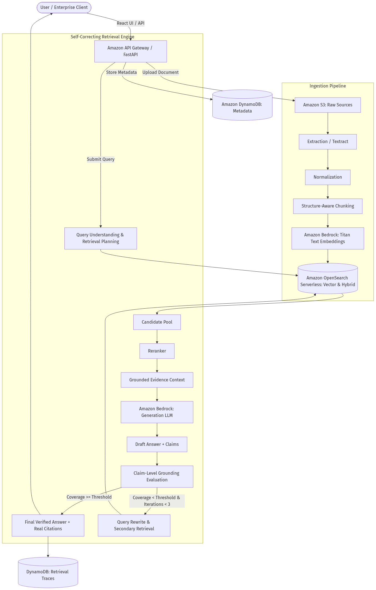
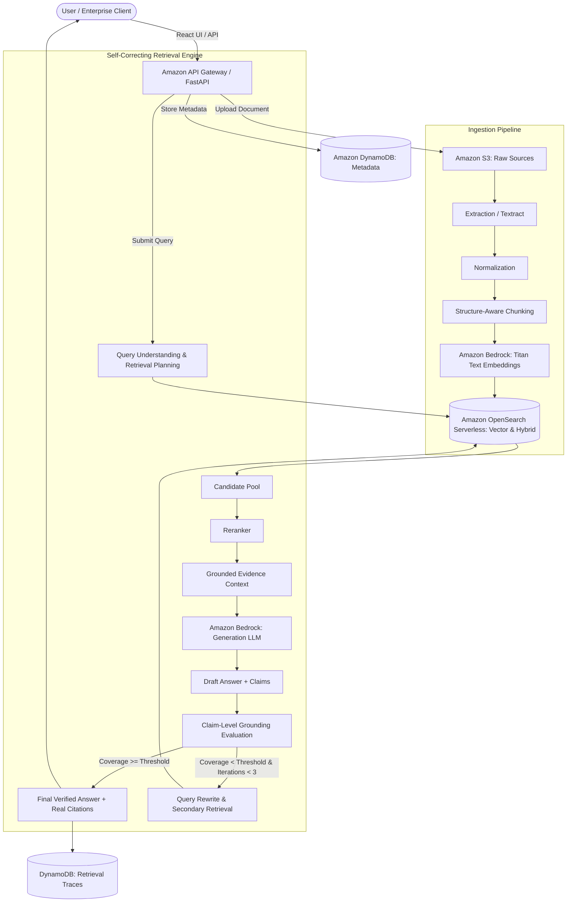

# Architecture Flowchart

<b>Mermaid Diagram Source Code</b>

```mermaid
flowchart TD
    User([User / Enterprise Client]) -->|React UI / API| APIGW[Amazon API Gateway / FastAPI]
    APIGW -->|Upload Document| S3Raw[Amazon S3: Raw Sources]
    APIGW -->|Store Metadata| DDBMeta[(Amazon DynamoDB: Metadata)]
    
    subgraph Ingestion Pipeline
        S3Raw --> Extract[Extraction / Textract]
        Extract --> Norm[Normalization]
        Norm --> Chunk[Structure-Aware Chunking]
        Chunk --> BedrockEmb[Amazon Bedrock: Titan Text Embeddings]
        BedrockEmb --> OSIndex[(Amazon OpenSearch Serverless: Vector & Hybrid)]
    end

    subgraph Self-Correcting Retrieval Engine
        APIGW -->|Submit Query| QueryPlan[Query Understanding & Retrieval Planning]
        QueryPlan --> OSIndex
        OSIndex --> Candidates[Candidate Pool]
        Candidates --> Rerank[Reranker]
        Rerank --> Evidence[Grounded Evidence Context]
        Evidence --> BedrockGen[Amazon Bedrock: Generation LLM]
        BedrockGen --> AnswerDraft[Draft Answer + Claims]
        AnswerDraft --> GroundingEval[Claim-Level Grounding Evaluation]
        
        GroundingEval -->|Coverage >= Threshold| FinalAnswer[Final Verified Answer + Real Citations]
        GroundingEval -->|Coverage < Threshold & Iterations < 3| ReQuery[Query Rewrite & Secondary Retrieval]
        ReQuery --> OSIndex
    end

    FinalAnswer --> Trace[(DynamoDB: Retrieval Traces)]
    FinalAnswer --> User
```

